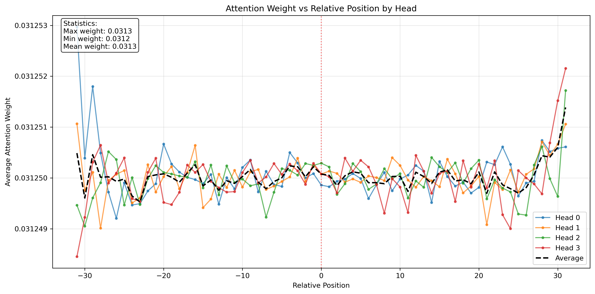
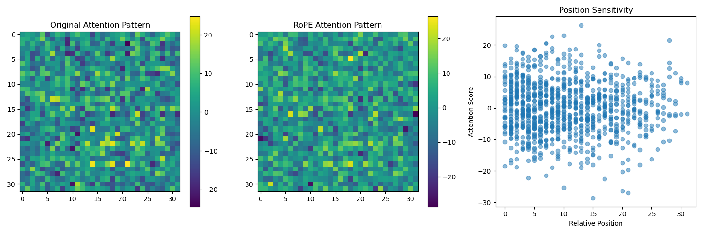

# C++ Extensions for NanoBERT

This project implements customized attention mechanism using C++ extensions Pytorch, loading a BERT model from HuggingFace (https://huggingface.co/alan-yahya/NanoBERT-V2).

For more info on C++ extensions for Pytorch see https://pytorch.org/tutorials/advanced/cpp_extension.html.




## Features

- Custom attention implementations
- Integration with HuggingFace's Pytorch BERT models
- Support for pre-tokenized datasets

## Project Structure

### Training
- `run_mlm-from_pretokenized.py`
  - Pre-tokenized dataset support
  - HuggingFace Trainer integration
  - MLM training configuration

### Build System
- `setup.py`
  - C++ extension compilation
  - MSVC/ninja build configuration
  - Package metadata

- `pyproject.toml`
  - Build dependencies
  - Package configuration

## Installation

1. Install build dependencies:
```bash
pip install -r requirements.txt
```

2. Build the C++ extension:
```bash
python build.py
```

3. Install the package:
```bash
pip install -e .
```

4. If you modify the C++ code, rebuild the extension:
```bash
pip install --force-reinstall -e .
```

## Usage

Example usage:

```
python test_extension.py
python test_rope_attention.py
```

```python
from custom_bert import CustomBertModel

# Initialize model
model = CustomBertModel.from_pretrained('bert-base-uncased')

# Forward pass with optimized attention
outputs = model(
    input_ids=input_ids,
    attention_mask=attention_mask
)
```

## Training

To train using the custom attention mechanism:

```bash
python run_mlm-from_pretokenized.py \
    --model_name_or_path bert-base-uncased \
    --train_file path/to/train.txt \
    --validation_file path/to/val.txt \
    --do_train \
    --do_eval \
    --output_dir ./output
```

## License

This project is licensed under the Apache License 2.0 - see the LICENSE file for details.
